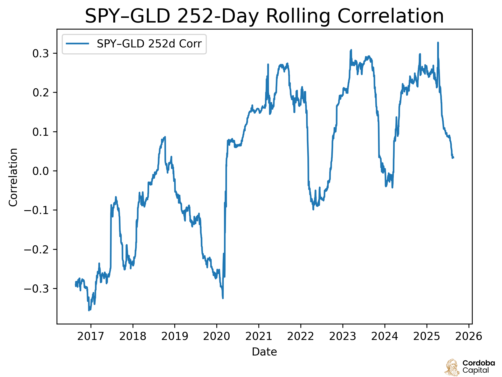
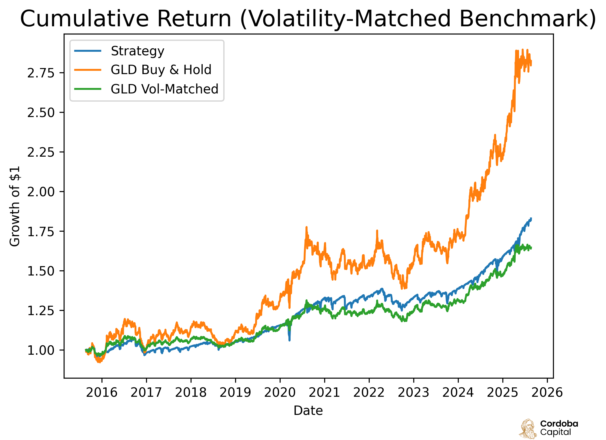
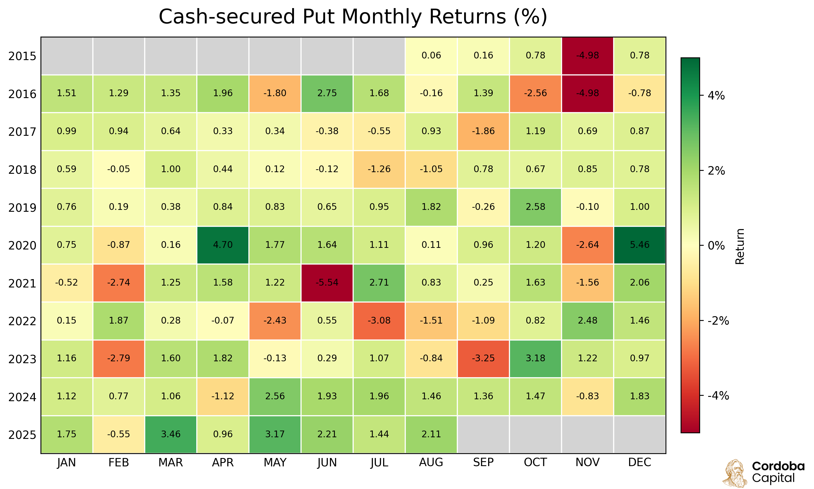
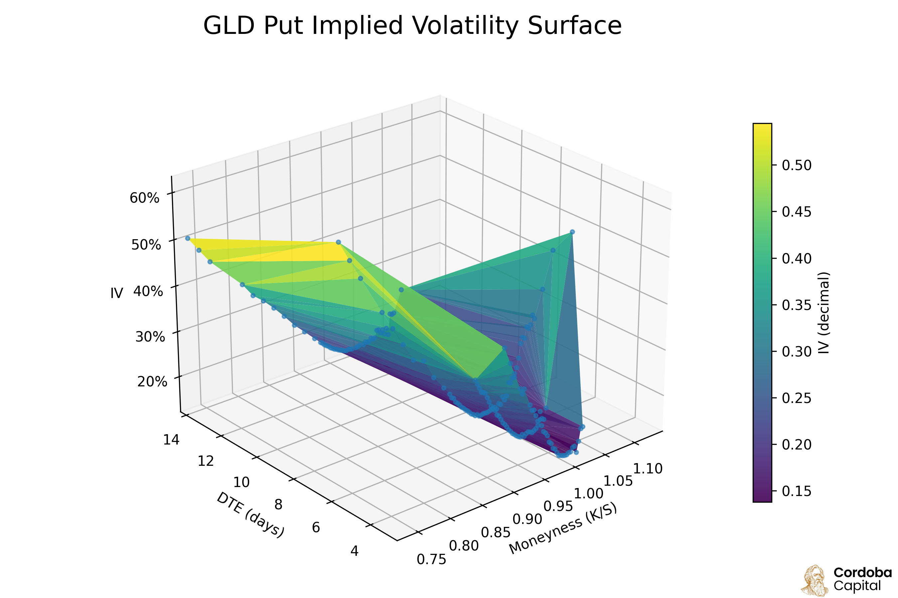

# GLD-Income-Strategy-with-Cash-secured-Put

# GLD Cash-Secured Put Strategy Backtest

This project implements and backtests a **short 25-delta cash-secured put strategy** on the **GLD ETF**.  
It uses historical GLD/SPY data (via IBKR or Yahoo Finance) and a Black–Scholes model with realized volatility proxy to simulate option pricing.

---

## 📌 Strategy Overview
- **Instrument:** GLD ETF
- **Position:** Short 25-delta cash-secured put
- **Target Expiry:** 30 days to expiration (DTE)
- **Exit Rules:**
  - Take profit at **60% of max profit**
  - Early probabilistic exit if near expiry and slightly ITM
  - Automatic settlement at expiry
- **Capital Allocation:**
  - **Cash-secured** (strike × 100 reserved per contract)
  - Maximum concurrent positions: 10
- **Benchmark:** GLD Buy & Hold

---

## ⚙️ Features
- Historical data pull from **Interactive Brokers (IBKR)** with fallback to **Yahoo Finance**.
- **Synthetic data mode** for offline testing.
- **Black–Scholes pricing functions**:
  - Put price
  - Put delta
  - Implied volatility inversion
- Rolling **realized volatility proxy** (21-day).
- Backtest with daily position management and cash accrual at the risk-free rate.
- Performance metrics:
  - CAGR
  - Sharpe Ratio
  - Maximum Drawdown
- Visualizations:
  - Rolling correlation (SPY–GLD)
  - Volatility-matched cumulative returns
  - Monthly return heatmap
  - GLD implied volatility surface

---

## 🛠 Requirements
Install dependencies:
```bash
pip install pandas numpy matplotlib seaborn scipy ib_insync yfinance

##  Contributors

Zifan Li
